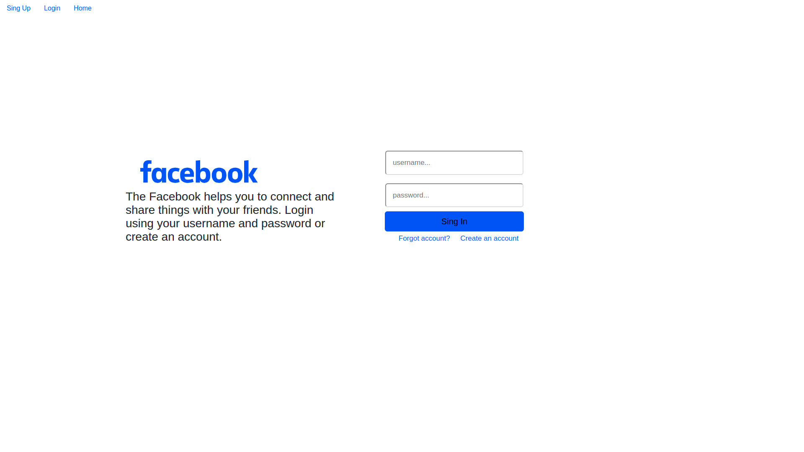
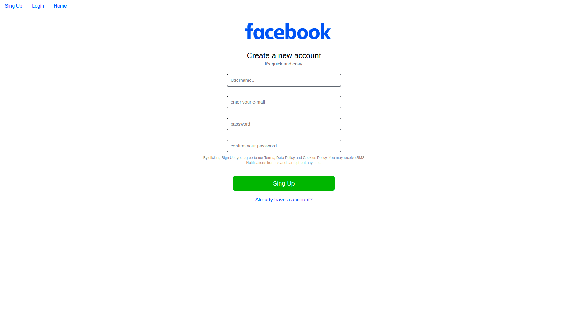

Facebook clone

Read requirements.txt to see what you'll need.

<h1>Web app with Django - Facebook Clone</h1>

 
<h2 align="center">About</h2>

This project is an app that can storege users.
you will need an account to access the webapp, so there is a sing-up page. 
Created using django and Bootstrap.
Its just a Facebook login and register clone, so it doesn't contains any part of the site  

<h2>Requirements</h2>
  
<ul>
  <li>asgiref==3.5.0</li>
  <li>backports.zoneinfo==0.2.1</li>
  <li>sqlparse==0.4.2</li>
  <li>Django==4.0.3</li>
</ul>

<h2 align="center">
  Project Printscreen 
</h2>
 
<h1>
	
	
</h1>